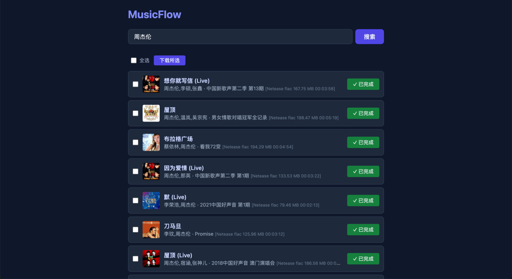

# MusicFlow

轻量级音乐搜索下载入库工具：Web 端搜索歌曲、一键下载，自动补全 ID3 标签/封面/歌词，并触发 [Swing Music](https://github.com/swingmx/swingmusic) 扫描入库，实现"即搜、即下、即听"。



- 后端：FastAPI + [musicdl](https://github.com/CharlesPikachu/musicdl)（网易/QQ/酷狗/酷我/咪咕等多源）
- 前端：单页 HTML，支持批量选择下载、任务状态实时跟踪
- 下载：串行队列，自动写入 ID3/封面/歌词（.lrc）
- 联动：下载完成后去抖触发 Swing Music `trigger-scan`

## 本地开发

```bash
uv sync
MUSIC_DIR=./music SWING_URL=http://localhost:1970 \
  uv run uvicorn app.main:app --reload --port 8000
```

访问 http://localhost:8000

## Docker 部署

直接使用 CI 构建的镜像：

```bash
docker run -d --name musicflow \
  -p 8000:8000 \
  -e MUSIC_DIR=/music \
  -e SWING_URL=http://<swing-music地址>:1970 \
  -e SWING_USERNAME=<用户名> \
  -e SWING_PASSWORD=<密码> \
  -v /path/to/music:/music \
  ghcr.io/<owner>/musicflow:latest
```

或本地构建（`docker compose up -d --build`）。

> 注意：`/music` 挂载的目录必须与 Swing Music 的 root dir 是同一目录。
> 服务无鉴权，请勿暴露公网。

## 环境变量

| 变量 | 默认值 | 说明 |
| --- | --- | --- |
| `MUSIC_DIR` | `./music` | 音乐保存目录 |
| `SWING_URL` | 空 | Swing Music 地址，为空则不触发扫描 |
| `SWING_SCAN_PATH` | `/notsettings/trigger-scan` | Swing 扫描接口路径 |
| `SWING_USERNAME` | 空 | Swing 用户名（开启用户系统后必填） |
| `SWING_PASSWORD` | 空 | Swing 密码（开启用户系统后必填） |
| `MUSIC_SOURCES` | 咪咕/网易/QQ/酷我/千千 | 启用的音源，逗号分隔 |
| `SEARCH_SIZE` | `10` | 每个音源返回的结果数 |
| `CACHE_TTL` | `1800` | 搜索结果缓存秒数（过期需重新搜索） |
| `SCAN_DEBOUNCE` | `5` | 扫描触发去抖秒数 |

## 声明

仅供学习研究使用，请尊重各音乐平台版权与条款；musicdl 采用 PolyForm Noncommercial 协议，禁止商用。
